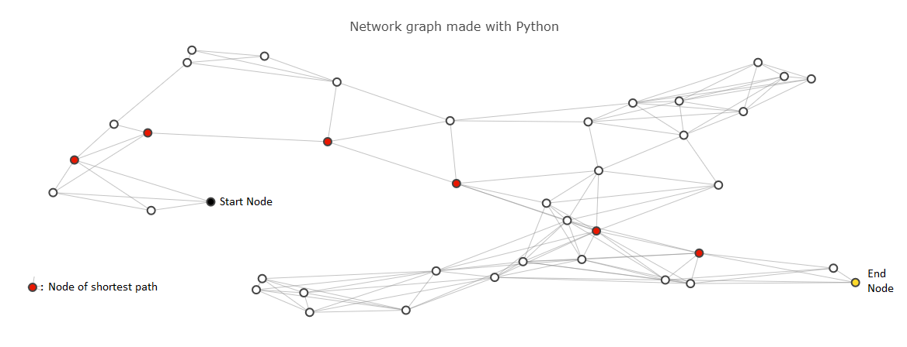

# Route Planner
A route-planning application based on A* to calculate the shortest path between two points on a map.




## Getting Started
### Dependencies
* A package manager, such as pip (recommended) or conda.
    
    Installing pip: https://packaging.python.org/guides/installing-using-pip-and-virtual-environments/
    
    Installing conda: https://docs.conda.io/projects/conda/en/latest/user-guide/install/index.html

* Python 3 (Version 3.9 is not supported) 
* Jupyter Notebook

    Recommended to 

### Installing
1. Clone project
    ```bash
    git clone https://github.com/mehmetalici/route-planner.git
    ```
2. Install Python dependencies 
    
    Using pip (Linux/macOS):
    ```bash
    python3 -m venv env  
    source env/bin/activate
    python3 -m pip install -r requirements.txt
    ```
3. To test installation, run:
    ```bash
    python test.py
    ```
### Executing the Program
1. Start Jupyter notebook app:
    ```bash
    jupyter notebook
    ```
    This will launch a new browser window.
2. In the opened browser window, open `project_notebook.ipynb` which is found in the project root directory.   

3. You can visualize different paths changing `start` and `goal` in the following function call:
    ```python
    show_map(map_40, start=8, goal=24, path=shortest_path(map_40, start=8, goal=24)) 
    ```
